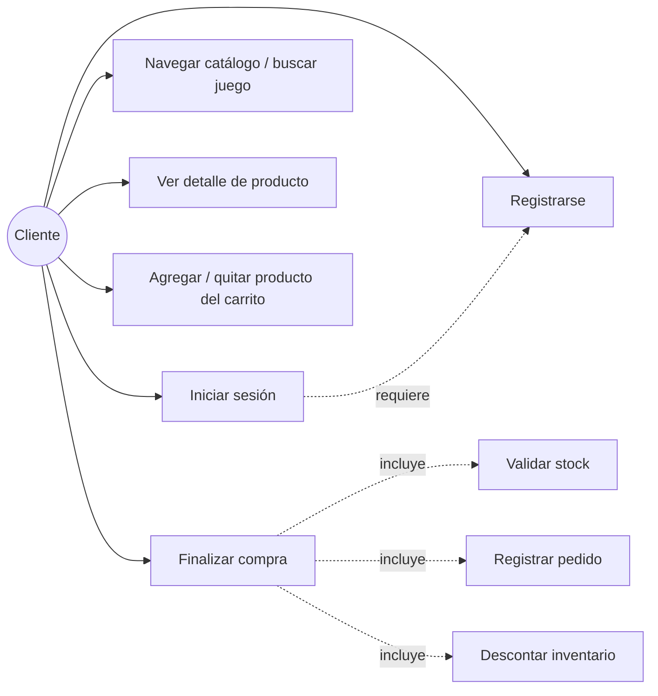
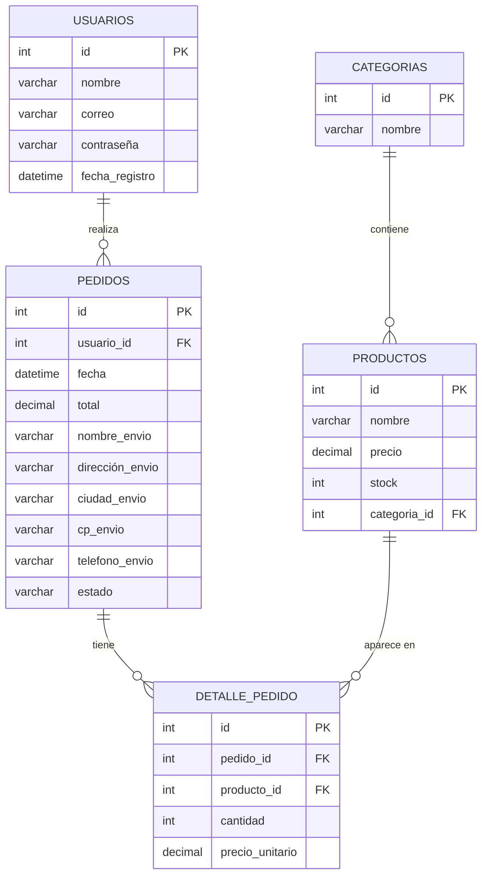
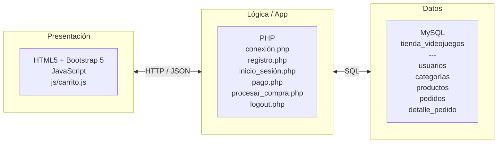
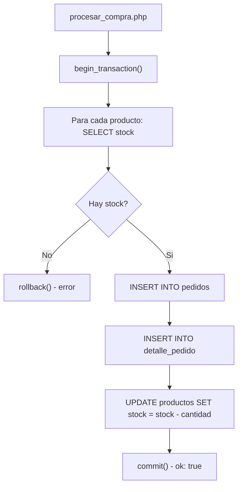

# Tienda de Videojuegos

Proyecto individual - Materia: Desarrollo e Implementación de Sistemas  
Entrega: domingo 28 de junio de 2026 - Docente: Fidel Bojorquez Solis

---

## 1. Introducción

Este proyecto es una tienda en linea de videojuegos hecha con PHP, MySQL y Bootstrap 5. La idea es que un cliente pueda registrarse, iniciar sesión, navegar el catálogo por categorías, agregar juegos al carrito y completar su compra proporcionando sus datos de envio. Al confirmar, el sistema descuenta automaticamente el inventario en la base de datos.

Lo desarrolle como proyecto individual para la materia de Desarrollo e Implementación de Sistemas.

---

## 2. Resumen del sistema

| Módulo | Descripción |
|---|---|
| Inicio | Página principal con categorías, buscador y accesos rápidos |
| Catálogo | Páginas por categoria: Accion y Aventura, RPG, JRPG, Shooter, Peleas y Ofertas |
| Detalle de producto | Trailer, descripción, precio y boton "Agregar al carrito" |
| Carrito | Panel flotante en todas las páginas de producto; permite agregar, quitar o vaciar |
| Registro / Login | Formularios con validación y contraseñas cifradas |
| Pago | Requiere sesión activa; captura datos de envio y simula el pago; actualiza el stock |
| Blog / Noticias / Resenas | Secciones informativas estaticas |

---

## 3. Requisitos

### Requisitos Funciónales

| # | Requisito |
|---|---|
| 1 | El cliente puede registrarse con nombre, correo electronico y contraseña. |
| 2 | El cliente puede iniciar sesión con su correo y contraseña. |
| 3 | El cliente puede navegar el catálogo organizado por categorías de juegos. |
| 4 | El cliente puede ver el detalle de cada juego (imagen, descripción, precio, trailer). |
| 5 | El cliente puede agregar juegos al carrito de compras desde la página de detalle. |
| 6 | El cliente puede quitar un juego del carrito o vaciarlo por completo antes de pagar. |
| 7 | El sistema requiere que el cliente haya iniciado sesión para acceder a la página de pago. |
| 8 | El cliente proporciona datos de envio (nombre, dirección, ciudad, CP, telefono) para completar la compra. |
| 9 | Al confirmar la compra, el sistema valida que haya stock suficiente de cada producto. |
| 10 | Al confirmar la compra, el sistema registra el pedido y descuenta el stock de cada producto comprado. |
| 11 | El cliente puede buscar juegos por nombre desde la barra de busqueda en la página de inicio. |

### Requisitos No Funciónales

| # | Requisito |
|---|---|
| 1 | La interfaz es responsiva y funciónal en cualquier navegador moderno (Bootstrap 5). |
| 2 | Las contraseñas se almacenan cifradas con `password_hash()` y se verifican con `password_verify()`; nunca en texto plano. |
| 3 | Todas las consultas a la base de datos usan sentencias preparadas (`mysqli prepare`) para prevenir inyeccion SQL. |
| 4 | La sesión del usuario se mantiene mediante `$_SESSION` mientras navega el sitio. |
| 5 | La conexión a la base de datos esta centralizada en un único archivo (`conexión.php`). |
| 6 | La lógica del carrito esta encapsulada en un único archivo JavaScript (`js/carrito.js`) reutilizado en todas las páginas. |
| 7 | El procesamiento de la compra es transacciónal: si ocurre algun error, se hace `rollback` y no se modifica el inventario ni se guarda el pedido de forma parcial. |

### Requisitos Técnicos

- Servidor web con soporte para PHP 7.4 o superior (Apache / XAMPP / Laragon)
- MySQL 5.7+ o MariaDB con la extension `mysqli` habilitada
- Navegador actualizado: Chrome, Firefox o Edge

---

## 4. Casos de uso

### Diagramas



### Descripción de casos de uso

**Registrarse**
El cliente ingresa nombre, correo y contraseña. El sistema verifica que el correo no exista, guarda el usuario con la contraseña cifrada y muestra un mensaje de éxito.

**Iniciar sesión**
El cliente ingresa correo y contraseña. El sistema consulta la base de datos, verifica la contraseña con `password_verify()` e inicia la sesión.

**Navegar catálogo y ver detalle**
El cliente selecciona una categoria, ve las tarjetas de productos y puede entrar al detalle de cada juego donde aparece el trailer, descripción y precio.

**Gestionar carrito**
Desde la página de detalle el cliente puede agregar juegos al carrito, quitar productos individuales o vaciarlo completo. El carrito se guarda en `localStorage` del navegador.

**Finalizar compra**
El cliente necesita sesión activa para entrar a `pago.php`. Ahi revisa el carrito, llena los datos de envio y confirma. El servidor verifica el stock, guarda el pedido y descuenta el inventario todo en una transacción. Si algo falla se hace rollback y no queda nada guardado a medias.

---

## 5. Entidades, Atributos y Relaciónes

### Diagrama Entidad-Relación



### Cardinalidad

| Relación | Tipo |
|---|---|
| Usuario - Pedidos | 1 : N (un usuario puede tener muchos pedidos) |
| Categoria - Productos | 1 : N (una categoria tiene muchos productos) |
| Pedido - DetallePedido | 1 : N (un pedido contiene muchos items) |
| Producto - DetallePedido | 1 : N (un producto puede aparecer en muchos pedidos) |

---

## 6. Arquitectura del sistema

**Tipo: Cliente-Servidor de 3 capas**

Se eligio esta arquitectura porque separa la presentación, la lógica de negocio y los datos. Cada capa se puede modificar sin afectar las demas, lo cual hizo mas facil depurar errores durante el desarrollo.



- **Presentación**: Archivos `.html` para el catálogo y `.php` para páginas con contenido dinamico. El carrito vive en `localStorage` hasta que se procesa la compra.
- **Lógica de negocio**: `procesar_compra.php` maneja toda la transacción de compra con `begin_transaction` / `commit` / `rollback`.
- **Datos**: Base de datos MySQL con 5 tablas. Todas las consultas usan sentencias preparadas.

---

## 7. Diseño de interfaz

| Pantalla | Archivo | Descripción |
|---|---|---|
| Inicio | `index.html` | Navegacion, buscador, categorías y noticias |
| Iniciar sesión | `inicio_sesión.php` | Formulario de correo y contraseña |
| Registro | `registro.php` | Formulario de nombre, correo y contraseña |
| Catálogo | `accionyaventura.html`, `rpg.html`, etc. | Tarjetas de productos por categoria |
| Detalle de juego | `AccionyAventura/`, `RPG/`, etc. | Trailer, descripción, precio y carrito |
| Pago | `pago.php` | Resumen de carrito, datos de envio y confirmacion |

---

## 8. Estructura del proyecto

```
Tienda-de-videojuegos/
|
+-- basedatos/
|   +-- tienda_videojuegos.sql
|
+-- README.md
|
+-- PáginaTiendaVideojuegos/
    |
    +-- index.html
    +-- index.php
    +-- página02.html
    |
    +-- accionyaventura.html
    +-- rpg.html
    +-- jrpg.html
    +-- shooter.html
    +-- peleas.html
    +-- ofertas.html
    |
    +-- AccionyAventura/
    +-- RPG/
    +-- JRPG/
    +-- Shooter/
    +-- Peleas/
    +-- Ofertas/
    |
    +-- inicio_sesión.php
    +-- registro.php
    +-- logout.php
    +-- pago.php
    +-- procesar_compra.php
    +-- conexión.php
    |
    +-- blog.html
    +-- Noticias.html
    +-- resenas.html
    +-- noticia1.html
    +-- noticia2.html
    +-- noticia3.html
    |
    +-- css/
    |   +-- estilo.css
    |
    +-- js/
    |   +-- carrito.js
    |
    +-- imagenes/
```

---

## 9. Instalación y configuración

**Requisitos previos**: XAMPP (o cualquier stack con Apache + MySQL + PHP) y un navegador actualizado.

1. Descomprimir el proyecto dentro de `htdocs`:
   ```
   C:\xampp\htdocs\Tienda-de-videojuegos\
   ```

2. Importar la base de datos en phpMyAdmin: Importar el archivo `basedatos/tienda_videojuegos.sql`. Esto crea la base de datos con todas las tablas y productos.

3. Verificar la conexión en `PáginaTiendaVideojuegos/conexión.php`:
   ```php
   $conexión = new mysqli("localhost", "root", "", "tienda_videojuegos");
   ```
   Cambiar usuario y contraseña si tu MySQL los tiene diferentes.

4. Iniciar Apache y MySQL desde el panel de XAMPP.

5. Abrir en el navegador:
   ```
   http://localhost/Tienda-de-videojuegos/PáginaTiendaVideojuegos/index.html
   ```

---

## 10. Uso del sistema

| Paso | Accion | Página |
|---|---|---|
| 1 | Crear una cuenta nueva | `registro.php` |
| 2 | Iniciar sesión | `inicio_sesión.php` |
| 3 | Navegar el catálogo o buscar un juego | `index.html` |
| 4 | Abrir el detalle de un juego | `AccionyAventura/zelda.html`, etc. |
| 5 | Pulsar Agregar al carrito | Panel flotante en la misma página |
| 6 | Revisar o modificar el carrito | Panel flotante |
| 7 | Ir a Finalizar compra | `pago.php` |
| 8 | Llenar datos de envio y confirmar | `pago.php` hacia `procesar_compra.php` |
| 9 | Ver confirmacion del pedido | Pantalla de agradecimiento |

No hay usuario de prueba precargado, hay que registrar una cuenta desde el paso 1.

---

## 11. Base de datos

Script completo: [`basedatos/tienda_videojuegos.sql`](basedatos/tienda_videojuegos.sql)

**Tabla usuarios**
| Campo | Tipo | Descripción |
|---|---|---|
| id | INT PK AUTO_INCREMENT | Identificador único |
| nombre | VARCHAR(50) | Nombre del cliente |
| correo | VARCHAR(100) UNIQUE | Correo electronico |
| contraseña | VARCHAR(255) | Hash generado con `password_hash()` |
| fecha_registro | DATETIME | Fecha y hora del registro |

**Tabla categorías**
| Campo | Tipo | Descripción |
|---|---|---|
| id | INT PK AUTO_INCREMENT | Identificador único |
| nombre | VARCHAR(50) | Nombre de la categoria |

Valores: Accion y Aventura, RPG, JRPG, Shooter, Peleas, Ofertas.

**Tabla productos**
| Campo | Tipo | Descripción |
|---|---|---|
| id | INT PK AUTO_INCREMENT | Identificador único |
| nombre | VARCHAR(100) | Nombre del juego |
| precio | DECIMAL(10,2) | Precio en dolares |
| stock | INT | Unidades disponibles |
| categoria_id | INT FK | Referencia a categorías |

**Tabla pedidos**
| Campo | Tipo | Descripción |
|---|---|---|
| id | INT PK AUTO_INCREMENT | Identificador único |
| usuario_id | INT FK | Referencia a usuarios |
| fecha | DATETIME | Fecha y hora de la compra |
| total | DECIMAL(10,2) | Monto total |
| nombre_envio | VARCHAR(100) | Nombre para la entrega |
| dirección_envio | VARCHAR(150) | Dirección |
| ciudad_envio | VARCHAR(80) | Ciudad |
| cp_envio | VARCHAR(10) | Codigo postal |
| telefono_envio | VARCHAR(20) | Telefono |
| estado | VARCHAR(20) | Estado del pedido |

**Tabla detalle_pedido**
| Campo | Tipo | Descripción |
|---|---|---|
| id | INT PK AUTO_INCREMENT | Identificador único |
| pedido_id | INT FK | Referencia a pedidos |
| producto_id | INT FK | Referencia a productos |
| cantidad | INT | Unidades compradas |
| precio_unitario | DECIMAL(10,2) | Precio al momento de la compra |

### Flujo de compra



---

## 12. Conclusión

Lo que mas me costo fue la conexión a la base de datos y el sistema de compras, especialmente lograr que el stock se descontara correctamente al finalizar una compra sin dejar datos a medias si algo salia mal. Lo resolvi usando transacciónes en MySQL con `begin_transaction` y `rollback`.

Al final el proyecto quedo funciónando como una página de compras normal, que era el objetivo. Se que le falta mucho por mejorar, en el futuro le podria añadir mas juegos, accesorios como mandos, teclados o mouse, y pulir algunas cosas del diseño. Pero para ser mi primera aplicación web completa con base de datos, estoy contento con como quedo.
